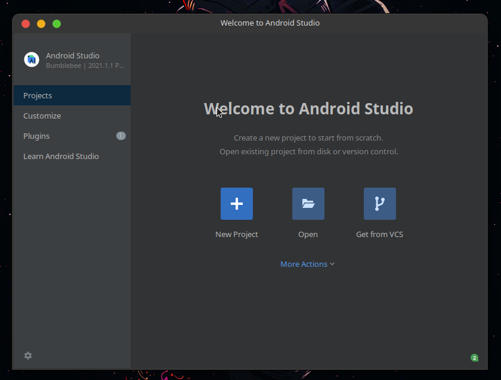
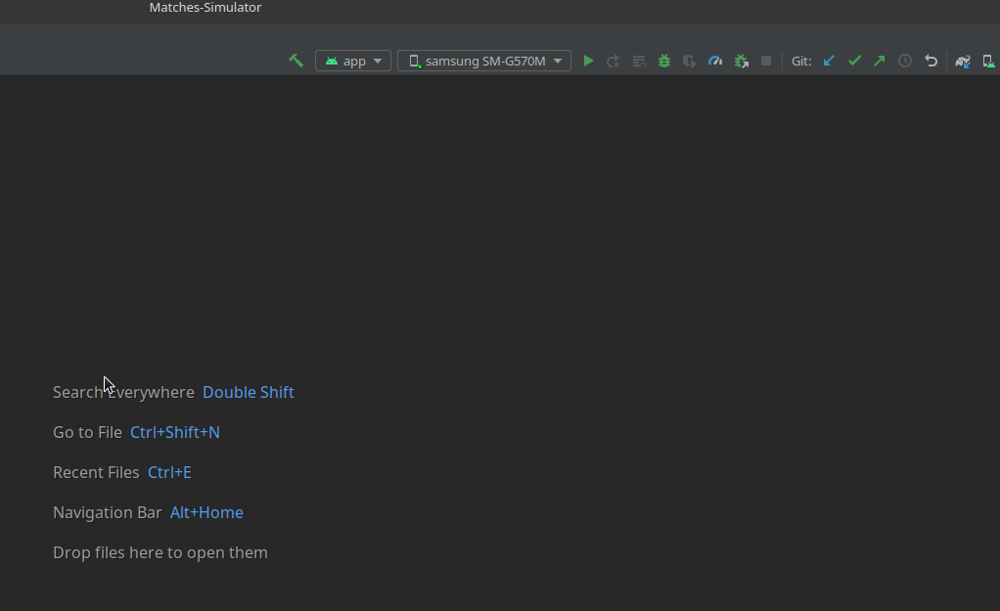

	

 ## Match Simulator - Simulador de Partidas
**O Projeto Match Simulartor teve o objetivo de  colocar em pratica tudo que aprendemos nos modulos anteriores,  criando um projeto utilizando Kotlin e java e alguns frameworks como glide e retrofit para   de api.**
### 🖼️ Screenshots:

### ⚙️ Requisitos:
- [Android Studio](https://developer.android.com/studio)
- Um smartphone Android ou [Simulador](https://developer.android.com/studio/run/managing-avds?hl=pt-br)
- Modo [desenvolvedor](https://developer.android.com/studio/debug/dev-options?hl=pt-br) ativo caso esteja utilizando o smartphone android fisico

### 📱 Como rodar o App
#### com o android studio instalado basta abrir o projeto

	

#### com o projeto já importado vamos verificar se o o device foi escolhido corretamente e  em seguida  clicar no botão run e o android studio que ira buildar o projeto 

	

#### se tudo deu certo você estara vendo o resultado final do projeto Android.

###  :email: Contato: rafaelnunesmoura@protonmail.com
